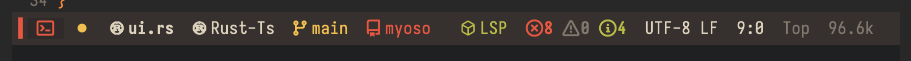
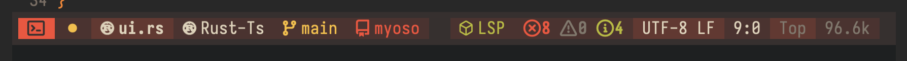
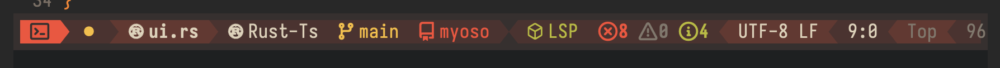
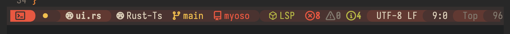
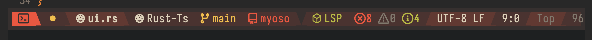

#+TITLE: elline.el
#+SUBTITLE: An elegant status line without extra fluff
#+AUTHOR: vmargb
#+OPTIONS: toc:2 num:nil

#+HTML: 

*Flat Style*
#+CAPTION: Flat style
#+ATTR_ORG: :width 900

*Block Style: None*
#+CAPTION: Block style with no separators
#+ATTR_ORG: :width 900

*Block style: Arrow*
#+CAPTION: Blocks style with arrow separators
#+ATTR_ORG: :width 900

*Block style: Curved*
#+CAPTION: Blocks style with curve separators
#+ATTR_ORG: :width 900

*Block style: Slanted*
#+CAPTION: Blocks style with slant separators
#+ATTR_ORG: :width 900

#+HTML: 

* Introduction

  =elline.el= is a lightweight, modular mode line for Emacs. It delivers the visual polish of doom-modeline while remaining minimal and customizable without extra fluff.

* Features

  - *Theme-adaptive colors* :: Blends foreground/background with your active theme using dynamic color blending.
  - *Diagnostic indicators* :: Flymake/Flycheck error, warning, and info counts with severity-aware coloring.
  - *Evil mode integration* :: Visual state indicator with icon support (normal, insert, visual, etc.).
  - *Modular zones* :: Left, center, and right segments composed via joiner functions for seamless customization.
  - *Responsive layout* :: Non-essential segments hide automatically in narrow windows.
  - *Separator styles* :: Choose none, arrow, curve, or slant glyphs for block-style mode lines.
  - *Height control* :: Adjust mode line height via =elline-height= (default: 120, i.e., 1.2× font size).
  - *Optional clock* :: Toggle HH:MM display at the far right.
  - *Inactive window dimming* :: Clear visual distinction between active and inactive buffers.

* Installation
This package is currently not on =Melpa=, for now use:

** =package-vc-install= (Emacs 29+)
#+BEGIN_SRC emacs-lisp
(use-package arrow
  :vc (:url "https://github.com/vmargb/elline")
  :config
  (elline-mode 1))
#+END_SRC

** Manual installation
#+BEGIN_SRC emacs-lisp
(add-to-list 'load-path "/path/to/elline")
(require 'elline)
(elline-mode 1)
#+END_SRC

* Quick Start

  1. Enable =elline-mode= globally.
  2. Toggle style with =C-c m b= (flat <-> blocks).
  3. Cycle separators with =C-c m s= (none -> arrow -> curve -> slant).
  4. Optional: show clock with =C-c m t=, cycle icon backends with =C-c m i=.

* Configuration

  All options are customizable via =M-x customize-group RET elline RET=, or set directly:

#+BEGIN_SRC emacs-lisp
(setq elline-height 100                    ; Slightly more compact
      elline-show-time t                   ; Show clock by default
      elline-theme-style 'blocks           ; Start with blocks style
      elline-separator-style 'curve        ; Use curved separators
      elline-icon-provider 'nerd-icons)    ; Icon backend
#+END_SRC

  *Key variables*:
  - =elline-height= :: Integer, mode line height in 1/10 pt units.
  - =elline-theme-style= :: =flat= or =blocks=.
  - =elline-separator-style= :: =none=, =arrow=, =curve=, or =slant=.
  - =elline-icon-provider= :: =nerd-icons=, =all-the-icons=, or =none=.
  - =elline-separator-raise= :: Float, vertical adjustment for separator glyphs (negative lowers).

* Troubleshooting

** Separators appear misaligned
   If powerline/nerd glyphs render slightly above the mode line baseline:
   - Adjust =elline-separator-raise= (try -0.08 to -0.15 for Iosevka Nerd Font).
   - Ensure your font is properly patched and Emacs is using the correct variant.
   - Restart Emacs after font changes to clear rendering caches.

** Icons not displaying
   - Verify =nerd-icons= or =all-the-icons= is installed and fonts are installed system-wide.
   - Run =M-x nerd-icons-install-fonts= if using the nerd-icons backend.
   - Set =elline-icon-provider= to =none= to fall back to text-only indicators.
